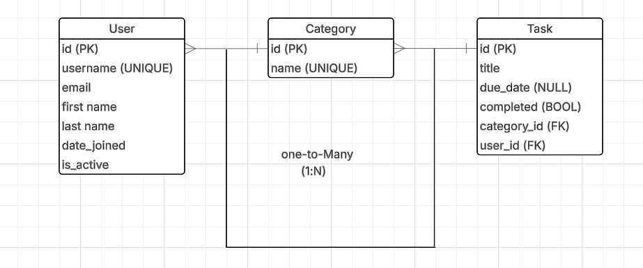

# Ticksy

A task management application built with Django.

## 📊 Entity Relationship Diagram (ERD)

The Ticksy system has three main entities: User, Category, and Task.

### Basic Description

The database has three tables:

- **User**: Stores user account information (uses Django's built-in User model)
- **Category**: Stores task categories (like "Work", "Personal", etc.)
- **Task**: Stores individual tasks with title, due date, and completion status

### Relationships

- Each user can have many tasks (One-to-Many)
- Each category can have many tasks (One-to-Many)
- Each task belongs to one user and one category

This simple structure allows users to organize their tasks by category and track completion status.

### Testing

  <table border="1">
  <tr>
    <th>Feature</th>
    <th>Test Case</th>
    <th>Expected Result</th>
    <th>Result</th>
  </tr>
  <tr><td>User Registration</td><td>	Navigate to the registration page. Fill in the form with valid details and submit.</td><td>User is registered and redirected to the login page.</td><td>PASS</td></tr>
  <tr><td></td><td>Attempt to register with an existing username or email.</td><td>Appropriate error message is displayed.</td><td>PASS</td></tr>
  <tr><td>User Login</td><td>Navigate to the login page. Fill in the form with valid credentials and submit.</td><td>User is logged in and redirected to the task list page.</td><td>PASS</td></tr>
  <tr><td></td><td>Attempt to log in with invalid credentials.</td><td>Appropriate error message is displayed.</td><td>PASS</td></tr>
  <tr><td>User Logout</td><td>While logged in, click the logout button.</td><td>User is logged out and redirected to the login page.</td><td>PASS</td></tr>
  <tr><td>Create Task</td><td>Click the "Add Task" button. Fill in the form with valid details.</td><td>Task is created and displayed in the task list.</td><td>PASS</td></tr>
  <tr><td>View task</td><td>Click on view</td><td>Could view tasks details</td><td>PASS</td></tr>
  <tr><td>Update Task</td><td>Click the "Edit" button for an existing task. Modify the details.</td><td>Task is updated and changes are reflected in the task list.</td><td>PASS</td></tr>
  <tr><td>Delete Task</td><td>Click the "Delete" button for an existing task. Confirm the deletion in the modal.</td><td>Task is removed from the task list.</td><td>PASS</td></tr>
  <tr><td>Mark Task as Completed</td><td>Click the completed button to mark a task as completed.</td><td>Task status is updated to "Completed" and visually distinguished from other tasks.</td><td>PASS</td></tr>
  <tr><td>View Tasks by Status</td><td>status of the task is displayed with a specific status (Pending,Completed).</td><td>Only tasks with the selected status are displayed.</td><td>PASS</td></tr>
  <tr><td>Filter Tasks by Category</td><td>Use the category filter to display tasks with a specific category (Work, Personal, Urgent).</td><td>Only tasks with the selected category are displayed.</td><td>PASS</td></tr>
  <tr><td>Username</td><td>Username is displayed</td><td>Once login username appears in navbar</td><td>Pass</td></tr>
</table>

### Automated Testing
This project includes a suite of automated tests to help ensure everything works as expected. The tests cover the most important features of the Ticksy app:

#### Form Validation:
We check that tasks can be created with valid data and that the form correctly rejects missing or invalid information.

#### Model Logic:
The tests confirm that tasks and categories are saved and displayed properly, and that default values (like task completion status) work as intended.

#### View and Permission Checks:
The app’s main views are tested to make sure only logged-in users can access or modify their own tasks. We also verify that users can’t change or delete tasks that belong to someone else.

#### CRUD Operations: 
Creating, updating, and deleting tasks are all tested to ensure these core features work smoothly.

To run the tests, simply use: python manage.py test This will automatically check all forms, models, and views for correct behavior.
