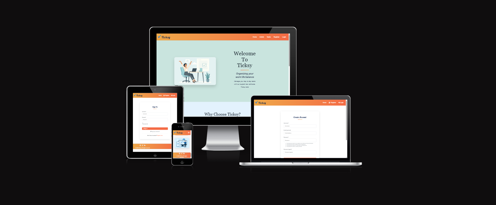
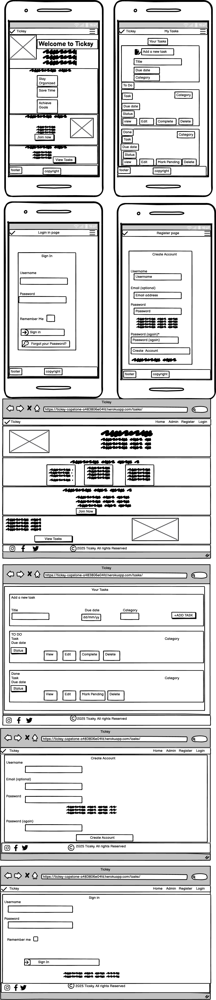
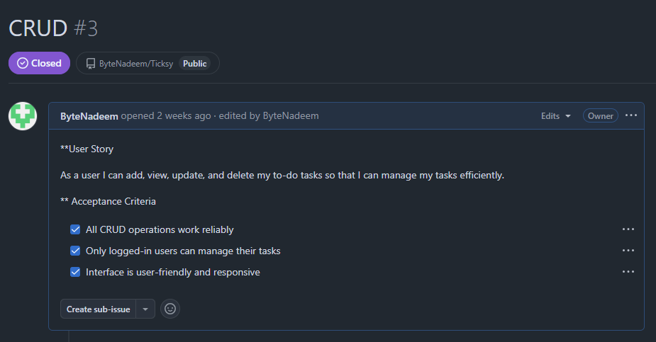
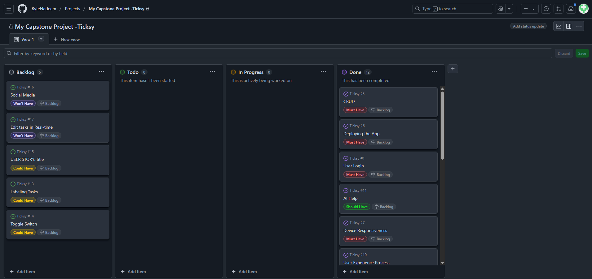
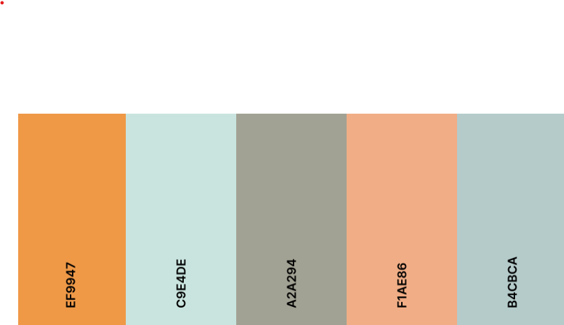

Ticksy poject by Nadeem Sardar

### Table of Contents

- [Ticksy](#ticksy)

  - [Table of Contents](#table-of-contents)

  - [Introduction](#introduction)
  - [Agile Planning](#agile-planning)
    - [UI Desgin](#ui-design)
    - [Wireframe](#wireframe)
    - [User Stories](#user-stories)
    - [Project Board](#project-board)
    - [Colour Scheme](#colour-scheme)
    - [Entity Relationship Diagram (ERD)](#-entity-relationship-diagram-erd)

### Introduction

Ticksy is task management application coded in html/css and python using the django framework.
The application provides a scalable & modern interface which allows users to manage their tasks easily and contains advanced features which allow users to organise & filter tasks.
You can use username:Test password:Password25? it has some tasks already added. 

### Repository

The Github repo can be found here.

[Github Repo](https://github.com/ByteNadeem/Ticksy)

The project Board can be found here.

[Github Project Board](https://github.com/users/ByteNadeem/projects/8)

The deployed Heroku project link can be found here.

[Deployed Link](https://ticksy-capstone-a483806e04fd.herokuapp.com/)

#### Agile Planning 
This project utilised an agile methodology for the project. making use of user stories, wireframes and a kanban board.

##### UI Design

Ticksy features a clean, modern, and responsive user interface designed for intuitive task management. The layout uses clear navigation, visually distinct buttons, and organized sections to help users easily add, view, edit, and filter their tasks. The design adapts to both desktop and mobile devices, ensuring a seamless experience across platforms. Visual feedback, color-coded statuses, and accessible forms make the app user-friendly and efficient for managing daily tasks.

##### Wrireframe

The wireframes illustrate the planned layout and user flow of the Ticksy app. They provide a visual guide for the structure and navigation.
The design did not change significantly during development but addition features, content and details were added to enhance the application beyond the initial scope.

##### User Stories

User stories define the main goals and actions for Ticksy users.  
They describe what users need to accomplish, such as registering, managing tasks, and filtering by category or status. These stories guided the development process to ensure the app meets real

###### Example

This user story outlines CRUD function. It specifies the user's goal to utilise CRUD function and the reason behind it (to keep track of to-do items). The story details the necessary criteria for fulfilling this requirement and lists the specific tasks that must be completed to implement the feature.
You can find more user stories on the project board, by using Github project board link above. 

##### Project Board

The project board tracks the progress of Ticksy’s development using a Kanban-style workflow.  
It organizes tasks into columns such as To Do, In Progress, and Done, helping to visualize priorities and monitor the completion of user stories and features throughout the project lifecycle.

##### Colour Scheme

The primary colours are shades of Butterscotch and Azure, chosen to create a vibrant and motivating interface. Secondary colours such as white and grey are used to provide contrast and enhance readability throughout the app.

## 📊 Entity Relationship Diagram (ERD)

The Ticksy system has three main entities: User, Category, and Task.

### Basic Description

The database has three tables:

- **User**: Stores user account information (uses Django's built-in User model)
- **Category**: Stores task categories (like "Work", "Personal", etc.)
- **Task**: Stores individual tasks with title, due date, and completion status

### Relationships

- Each user can have many tasks (One-to-Many)
- Each category can have many tasks (One-to-Many)
- Each task belongs to one user and one category

This simple structure allows users to organize their tasks by category and track completion status.

### Testing

  <table border="1">
  <tr>
    <th>Feature</th>
    <th>Test Case</th>
    <th>Expected Result</th>
    <th>Result</th>
  </tr>
  <tr><td>User Registration</td><td>	Navigate to the registration page. Fill in the form with valid details and submit.</td><td>User is registered and redirected to the login page.</td><td>PASS</td></tr>
  <tr><td></td><td>Attempt to register with an existing username or email.</td><td>Appropriate error message is displayed.</td><td>PASS</td></tr>
  <tr><td>User Login</td><td>Navigate to the login page. Fill in the form with valid credentials and submit.</td><td>User is logged in and redirected to the task list page.</td><td>PASS</td></tr>
  <tr><td></td><td>Attempt to log in with invalid credentials.</td><td>Appropriate error message is displayed.</td><td>PASS</td></tr>
  <tr><td>User Logout</td><td>While logged in, click the logout button.</td><td>User is logged out and redirected to the login page.</td><td>PASS</td></tr>
  <tr><td>Create Task</td><td>Click the "Add Task" button. Fill in the form with valid details.</td><td>Task is created and displayed in the task list.</td><td>PASS</td></tr>
  <tr><td>View task</td><td>Click on view</td><td>Could view tasks details</td><td>PASS</td></tr>
  <tr><td>Update Task</td><td>Click the "Edit" button for an existing task. Modify the details.</td><td>Task is updated and changes are reflected in the task list.</td><td>PASS</td></tr>
  <tr><td>Delete Task</td><td>Click the "Delete" button for an existing task. Confirm the deletion in the modal.</td><td>Task is removed from the task list.</td><td>PASS</td></tr>
  <tr><td>Mark Task as Completed</td><td>Click the completed button to mark a task as completed.</td><td>Task status is updated to "Completed" and visually distinguished from other tasks.</td><td>PASS</td></tr>
  <tr><td>View Tasks by Status</td><td>status of the task is displayed with a specific status (Pending,Completed).</td><td>Only tasks with the selected status are displayed.</td><td>PASS</td></tr>
  <tr><td>Filter Tasks by Category</td><td>Use the category filter to display tasks with a specific category (Work, Personal, Urgent).</td><td>Only tasks with the selected category are displayed.</td><td>PASS</td></tr>
  <tr><td>Username</td><td>Username is displayed</td><td>Once login username appears in navbar</td><td>PASS</td></tr>
</table>

### Automated Testing
This project includes a suite of automated tests to help ensure everything works as expected. The tests cover the most important features of the Ticksy app:

#### Form Validation:
We check that tasks can be created with valid data and that the form correctly rejects missing or invalid information.

#### Model Logic:
The tests confirm that tasks and categories are saved and displayed properly, and that default values (like task completion status) work as intended.

#### View and Permission Checks:
The app’s main views are tested to make sure only logged-in users can access or modify their own tasks. We also verify that users can’t change or delete tasks that belong to someone else.

#### CRUD Operations: 
Creating, updating, and deleting tasks are all tested to ensure these core features work smoothly.

To run the tests, simply use: python manage.py test This will automatically check all forms, models, and views for correct behavior.
