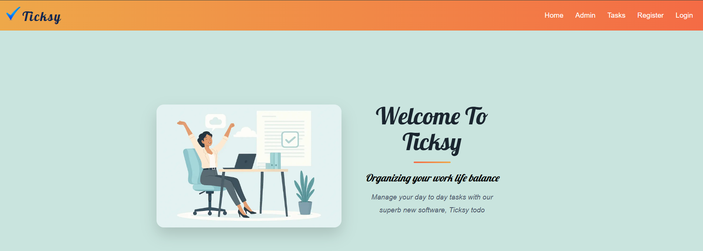

Ticksy poject by Nadeem Sardar

### Table of Contents

- [Ticksy](#ticksy)

  - [Table of Contents](#table-of-contents)

  - [Introduction](#introduction)
  - [Agile Planning](#agile-planning)
    - [UI Desgin](#ui-design)
    - [Wireframe](#wireframe)
    - [User Stories](#user-stories)
    - [Project Board](#project-board)
    - [Colour Scheme](#colour-scheme)
    - [Entity Relationship Diagram (ERD)](#-entity-relationship-diagram-erd)
  - [Features](#features)
    - [Existing Features](#existing-features)
    - [Features Left to Implement](#features-left-to-implement)
  - [Technologies Used](#technologies-used)
    - [How AI Was Used](#how-ai-was-used)
  - [Testing]
    - [Manual Testing](#manual-testing)
    - [Automated Testing](#automated-testing)
    - [Code Validation](#code-validation)
    - [Lighthouse Testing](#lighthouse-testing)
  - [Deployment](#deployment)
    - [Preparing My Project For Heroku](#preparing-my-project-for-heroku)
    - [Deploying to Heroku](#deploying-to-heroku)
  - [References](#references)
  
### Introduction

Ticksy is task management application coded in html/css and python using the django framework.
The application provides a scalable & modern interface which allows users to manage their tasks easily and contains advanced features which allow users to organise & filter tasks.
You can use username:Test password:Password25? it has some tasks already added. 

### Repository

The Github repo can be found here.

[Github Repo](https://github.com/ByteNadeem/Ticksy)

The project Board can be found here.

[Github Project Board](https://github.com/users/ByteNadeem/projects/8)

The deployed Heroku project link can be found here.

[Deployed Link](https://ticksy-capstone-a483806e04fd.herokuapp.com/)

### Agile Planning 
This project utilised an agile methodology for the project. making use of user stories, wireframes and a kanban board.

##### UI Design

Ticksy features a clean, modern, and responsive user interface designed for intuitive task management. The layout uses clear navigation, visually distinct buttons, and organized sections to help users easily add, view, edit, and filter their tasks. The design adapts to both desktop and mobile devices, ensuring a seamless experience across platforms. Visual feedback, color-coded statuses, and accessible forms make the app user-friendly and efficient for managing daily tasks.

##### Wrireframe

The wireframes illustrate the planned layout and user flow of the Ticksy app. They provide a visual guide for the structure and navigation.
The design did not change significantly during development but addition features, content and details were added to enhance the application beyond the initial scope.

##### User Stories

User stories define the main goals and actions for Ticksy users.  
They describe what users need to accomplish, such as registering, managing tasks, and filtering by category or status. These stories guided the development process to ensure the app meets real

#### Example

This user story outlines CRUD function. It specifies the user's goal to utilise CRUD function and the reason behind it (to keep track of to-do items). The story details the necessary criteria for fulfilling this requirement and lists the specific tasks that must be completed to implement the feature.
You can find more user stories on the project board, by using Github project board link above. 

#### Project Board

The project board tracks the progress of Ticksy’s development using a Kanban-style workflow.  
It organizes tasks into columns such as To Do, In Progress, and Done, helping to visualize priorities and monitor the completion of user stories and features throughout the project lifecycle.

#### Colour Scheme

The primary colours are shades of Butterscotch and Azure, chosen to create a vibrant and motivating interface. Secondary colours such as white and grey are used to provide contrast and enhance readability throughout the app.

#### 📊 Entity Relationship Diagram (ERD)

The Ticksy system has three main entities: User, Category, and Task.

##### Basic Description

The database has three tables:

- **User**: Stores user account information (uses Django's built-in User model)
- **Category**: Stores task categories (like "Work", "Personal", etc.)
- **Task**: Stores individual tasks with title, due date, and completion status

##### Relationships

- Each user can have many tasks (One-to-Many)
- Each category can have many tasks (One-to-Many)
- Each task belongs to one user and one category

This simple structure allows users to organize their tasks by category and track completion status.

### Features

#### Existing Features
  1. ###### Home Page 
  The home page welcomes users with an overview of Ticksy, highlights key features, and provides easy navigation to register or log in, benefits of the app. 

  

  2. ###### Tasks
The Tasks page allows users to add, view, edit, filter, and manage their to-do items.  
It displays tasks by category and status, provides quick actions for updating or deleting tasks, and helps users stay organized and productive.

  3. ###### Register
  The Register page allows new users to create an account by entering a username, email, and password. 
  It provides a simple, user-friendly form to enable quick and secure registration for access to all Ticksy features.

  

  4. ###### Log In
The Log In page allows existing users to securely access their Ticksy account by entering their username and password.It uses authentication to verify user credentials, ensuring that only registered users can view and manage their personal tasks.

  

  5. ###### Log out
  The Log out feature securely ends the user’s session and redirects them to the login page, ensuring their account remains protected when they leave the app.

  

  6. ###### Admin Features
  The Django Administration panel allows site administrators to manage users, tasks, and categories through a secure, user-friendly web interface.Admins can add, edit, or delete records, view all user data, and efficiently oversee the application's content and user activity.

  

  7. ###### Footer
  The footer provides quick access to social media links and displays copyright information, ensuring consistent branding and easy navigation across all pages.

  

#### Features left to Implement
  1. Social Media
  2. Edit tasks in Real-time
  3. Labeling Tasks
  4. Toggle Switch

### Technologies Used

1. HTML5 - The structure of the site was created using HTML5.
2. CSS3 - The styling of the site was created using CSS3.
3. JavaScript - The site uses JavaScript for interactivity through Djnago framework.
4. Python - The site uses Python for the backend.
5. Django - The site uses the Django web framework.
6. Bootstrap - The site uses the limited Bootstrap framework for styling.
7. Font Awesome - The site uses Font Awesome for icons.
8. Google Fonts - The site uses Google Fonts for typography.
9. Heroku - The site is deployed on Heroku.
10. PostgreSQL - The site uses a PostgreSQL database.
11. Cloudinary - I have installed Cloudinary but there was no need to use in my project.
12. Color Palettes - It was use to generate the colour scheme.
13. Favicons - It was used to get a favicon at the top of my page.
14. Squoosh - It was used to resize the images used in my project.
15. Visual Studio Code - Used as Intergrated Development Environment.

#### HOW AI Was Used
Artificial Intelligence played a significant role in the development of this project. Here are some ways AI was utilised:
###### Planning and Design
AI tools like Copilot were used to generate ideas and suggestions for the project. These tools provided insights and recommendations for the website's layout, features, and functionality. This helped streamline the planning and design process and ensure a more user-friendly and engaging final product.
###### Code Generation 
AI tools like GitHub Copilot were used to generate code snippets for various parts of the website. This included HTML structure and CSS styling. The AI provided context-aware suggestions that helped streamline the coding process and reduce development time.
###### Debugging
AI-powered debugging tools were utilised to identify and fix issues in the code. These tools analysed the codebase, detected potential bugs, and provided recommendations for resolving them. This ensured a smoother development process and a more robust final product.
###### Accessibility Improvements
AI was used to analyse the website's accessibility features. Tools like Lighthouse provided insights into how accessible the website is for users with disabilities and suggested improvements to enhance user experience. By leveraging AI, the project was able to achieve a higher level of efficiency, creativity, and accessibility.
###### Generating Images
AI tools were used to generate and enhance images for the project, providing custom graphics and optimized visuals that improve the overall look and user experience of the app.
###### Learning and Troubleshooting 
AI chat assistants were used to quickly resolve coding questions and troubleshoot development challenges. 

### Testing
The site was tested manually and using automated tests.

### Manual Testing
Manual testing was performed on the site to ensure that all features worked as expected. This included testing the following:

  <table border="1">
  <tr>
    <th>Feature</th>
    <th>Test Case</th>
    <th>Expected Result</th>
    <th>Result</th>
  </tr>
  <tr><td>User Registration</td><td>	Navigate to the registration page. Fill in the form with valid details and submit.</td><td>User is registered and redirected to the login page.</td><td>PASS</td></tr>
  <tr><td></td><td>Attempt to register with an existing username or email.</td><td>Appropriate error message is displayed.</td><td>PASS</td></tr>
  <tr><td>User Login</td><td>Navigate to the login page. Fill in the form with valid credentials and submit.</td><td>User is logged in and redirected to the task list page.</td><td>PASS</td></tr>
  <tr><td></td><td>Attempt to log in with invalid credentials.</td><td>Appropriate error message is displayed.</td><td>PASS</td></tr>
  <tr><td>User Logout</td><td>While logged in, click the logout button.</td><td>User is logged out and redirected to the login page.</td><td>PASS</td></tr>
  <tr><td>Create Task</td><td>Click the "Add Task" button. Fill in the form with valid details.</td><td>Task is created and displayed in the task list.</td><td>PASS</td></tr>
  <tr><td>View task</td><td>Click on view</td><td>Could view tasks details</td><td>PASS</td></tr>
  <tr><td>Update Task</td><td>Click the "Edit" button for an existing task. Modify the details.</td><td>Task is updated and changes are reflected in the task list.</td><td>PASS</td></tr>
  <tr><td>Delete Task</td><td>Click the "Delete" button for an existing task. Confirm the deletion in the modal.</td><td>Task is removed from the task list.</td><td>PASS</td></tr>
  <tr><td>Mark Task as Completed</td><td>Click the completed button to mark a task as completed.</td><td>Task status is updated to "Completed" and visually distinguished from other tasks.</td><td>PASS</td></tr>
  <tr><td>View Tasks by Status</td><td>status of the task is displayed with a specific status (Pending,Completed).</td><td>Only tasks with the selected status are displayed.</td><td>PASS</td></tr>
  <tr><td>Filter Tasks by Category</td><td>Use the category filter to display tasks with a specific category (Work, Personal, Urgent).</td><td>Only tasks with the selected category are displayed.</td><td>PASS</td></tr>
  <tr><td>Username</td><td>Username is displayed</td><td>Once login username appears in navbar</td><td>PASS</td></tr>
</table>

### Automated Testing
This project includes a suite of automated tests to help ensure everything works as expected. The tests cover the most important features of the Ticksy app:

###### Form Validation:
We check that tasks can be created with valid data and that the form correctly rejects missing or invalid information.

###### Model Logic:
The tests confirm that tasks and categories are saved and displayed properly, and that default values (like task completion status) work as intended.

###### View and Permission Checks:
The app’s main views are tested to make sure only logged-in users can access or modify their own tasks. We also verify that users can’t change or delete tasks that belong to someone else.

###### CRUD Operations: 
Creating, updating, and deleting tasks are all tested to ensure these core features work smoothly.
To run the tests, simply use: python manage.py test This will automatically check all forms, models, and views for correct behavior.

### Code Validation
The code was validated using the following tools:
  - HTML was validated using the W3C Markup Validation Service, the HTML code was reviewed and validated using the browser’s “View Page Source” feature to ensure accuracy and compliance.
A few minor trailing slash errors were detected, which did not affect the deployed project, but they were corrected to ensure clean and tidy code. 

 - CSS was validated using the W3C CSS Validation Service.

 

 - Python was validated using the CI Python Linter.
 A few minor white spaces,line too long and no new line at the end of file were detected, which did not affect the deployed project, but they were corrected to ensure clean and tidy code.

### Lighthouse Testing
The site was tested using Google LightHouse to check performance, accessibility, best practices, and SEO.

The low score for best practice is because of Found an h1 tag within an article, aside, nav, or section which does not have a specified font-size, this can be corrected in future. Some images size could be reduced to get better performance. 

### Deployment 
Deploying the application to heroku involved several steps.

1. #### Preparing My Project For Heroku

  - My project was uploaded to a github repository
  - Gunicorn was installed and configured
  - Ensure all dependencies are listed in requirements.txt and the python version is listed in
    .python-version
  - Configure static files and settings.py, paying special attention to disabling debugging and any other settings related to security.
  - Set up and configure environmental files eg. env.py
  - Create a Procfile. This file tells Heroku how to run your application.
  - Ensure that any files that contain secret keys or other sensitive information eg. env.py is added to .gitignore and is not present in your 
    github repo
    
  2. #### Deploying to Heroku

  - Click on New in the Heroku dashboard, and Create new app from the menu dropdown.
  - Give your new app a unique name, and choose a region, preferably one that is geographically closest to you.
  - Link github repository & Code Institute PostGres database.
  - Click "Create app".
  - Add environmental variables to heroku, such as, secret keys.
  - Deploy the application.

### References 

- [Django Documentation](https://docs.djangoproject.com/)
- [W3C Markup Validation Service](https://validator.w3.org/)
- [W3C CSS Validation Service](https://jigsaw.w3.org/css-validator/)
- [Bootstrap Documentation](https://getbootstrap.com/docs/5.0/getting-started/introduction/)
- [Font Awesome](https://fontawesome.com/)
- [Google Fonts](https://fonts.google.com/)
- [Heroku Documentation](https://devcenter.heroku.com/categories/reference)
- [GitHub Copilot](https://github.com/features/copilot)
- [Squoosh](https://squoosh.app/)
- [Coolors](https://coolors.co/)
- [Code Institute](https://codeinstitute.net/)
- [Stack Overflow](https://stackoverflow.com/)